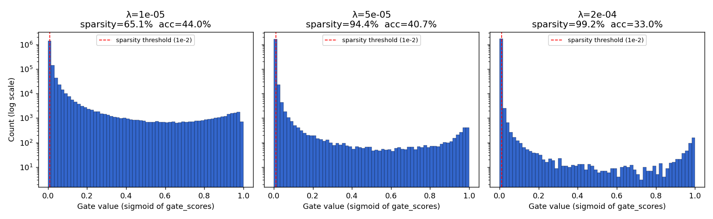

# Self-Pruning Neural Network — Report

_Tredence Analytics — AI Engineer case study_

## Architecture

A fully-connected feed-forward network; every Linear layer is replaced by a `PrunableLinear`, so **every weight in the model is subject to the gating mechanism** and the reported sparsity metric is end-to-end.

```
Input:   CIFAR-10 image  (3 × 32 × 32)
         → flatten       → 3072
         → PrunableLinear(3072 → 512)  → ReLU
         → PrunableLinear( 512 → 256)  → ReLU
         → PrunableLinear( 256 →  10)  → logits
```

Total gated weights ≈ 1,703,936 (3072·512 + 512·256 + 256·10). No dropout, no batch norm, no convolutions — the spec asked for a feed-forward network and the goal of this exercise is to demonstrate the gating mechanism cleanly, not to chase state-of-the-art CIFAR-10 numbers.

Each `PrunableLinear` holds three `nn.Parameter`s of shape `(out, in)`: `weight`, `gate_scores`, and (size `out`) `bias`. Its forward pass is `F.linear(x, weight * sigmoid(gate_scores), bias)`, so gradients flow through both `weight` and `gate_scores` automatically — no manual backward is needed.

## Why an L1 penalty on sigmoid gates encourages sparsity

Each weight `w_ij` in a `PrunableLinear` layer is multiplied by `g_ij = σ(s_ij)` where `s_ij ∈ ℝ` is a learnable "gate score". The total loss is

```
L_total = CE(logits, y) + λ · Σ_ij g_ij
```

Because every `g_ij ∈ (0, 1)` after the sigmoid, the second term is already the L1 norm of the gate vector (it equals `Σ |g_ij|`). L1 has a **constant-magnitude gradient** of `+1` with respect to each `g_ij`. For any gate whose contribution to the classification loss is smaller than `λ`, the optimizer strictly prefers pushing `g_ij` toward 0. Unlike L2, L1 does not weaken as the gate shrinks — the pressure continues all the way down, producing *exactly*-small gates rather than merely small ones.

The sigmoid layer gives a second sparsity-friendly property: once `s_ij` becomes very negative, `σ(s_ij)` is numerically indistinguishable from zero *and* `σ'(s_ij)` is itself near zero, so once a gate is "off" it tends to stay off. The combined dynamics of the two — L1 pressure from above and sigmoid saturation from below — produce the bimodal equilibrium visible in the plot below: gates either justify their ≈ λ cost and survive near 1, or get pushed all the way to 0, with very little mass in between.

One caveat worth calling out: **the sigmoid parameterization does not produce exact zeros** — it produces values that are numerically ≈ 0 (often below 1 × 10⁻⁶ in our runs) but never literally zero. "Sparsity" is therefore enforced at evaluation time via a small threshold (1 × 10⁻² here); for actual deployment you would harden that by applying a mask (`gates < ε → 0`) before inference so the dead weights can be skipped in the compute kernel. A "harder" alternative would be the Hard Concrete / L0-style reparameterization (Louizos et al., 2018), which yields true zeros at the cost of more implementation complexity.

## Results

| λ (lambda) | Test Accuracy (%) | Sparsity Level (%) |
|-----------:|------------------:|-------------------:|
| 1 × 10⁻⁵   | **43.98**         | 65.12              |
| 5 × 10⁻⁵   | 40.73             | 94.44              |
| 2 × 10⁻⁴   | 33.04             | **99.18**          |

_Sparsity level = percentage of gates whose sigmoid value is below 1 × 10⁻². Higher = more pruned._

### Gate value distribution across λ



The three panels show the sparsity-vs-accuracy dial being turned. Every panel is bimodal — a tall spike at 0 (pruned gates) and a small cluster near 1 (surviving gates) — and raising λ moves gates from the surviving cluster to the pruned spike. The log-scale y-axis is necessary: at λ = 2 × 10⁻⁴, the pruned spike holds ~99% of the 1.5 M gates; on a linear scale the surviving cluster is literally invisible.

## Discussion

λ is the explicit knob on the sparsity-vs-accuracy trade-off:

- **λ = 1 × 10⁻⁵** — mild penalty. The network keeps ~35% of its gates active and uses them for classification; test accuracy is best at 43.98%. The bimodality is already obvious but the "alive" cluster is tall: many weights are still contributing.
- **λ = 5 × 10⁻⁵** — middle. A 5× larger penalty prunes 94% of gates but test accuracy drops only ~3 points. This is the sparsity/accuracy sweet spot in this sweep: roughly 85K surviving gates out of 1.5M are doing almost all the work the full network was doing.
- **λ = 2 × 10⁻⁴** — aggressive. Only ~12K of 1.5M gates survive. The network still beats random by 3× (33% vs 10%) but the accuracy drop is meaningful; the penalty is starting to prune gates the classification loss actually wanted.

The monotonic trend — accuracy falls as sparsity rises — is exactly what the case study's intuition predicts: a higher `λ` buys you a lighter model at the cost of some predictive power. In a deployment context, λ would be chosen by fixing the target sparsity (i.e., the target FLOPs / memory budget) and reading accuracy off this curve.

## Implementation Notes

The three non-obvious things this project made me work through:

1. **Gradient flow through both `weight` and `gate_scores`.** The spec calls this out as the "challenge" and it was the first thing I verified. Because the forward pass is `F.linear(x, weight * sigmoid(gate_scores), bias)` using only differentiable PyTorch ops, autograd handles it — no custom `backward()`. `tests/test_prunable_linear.py::test_gradients_flow_to_weight_and_gate_scores` pins this down: after one backward, both `.grad` tensors are non-None and non-zero.

2. **Adam's gradient-magnitude normalization hides λ.** Adam scales each parameter's step to roughly the learning rate regardless of the raw gradient's magnitude. Under a single shared `lr` of 1e-3, no `gate_scores` parameter moved more than ~0.2 units in 10 epochs — nowhere near the ~5 units needed for `σ(·)` to fall below the 1e-2 threshold. Splitting the optimizer into two parameter groups (`lr_weights = 1e-3`, `lr_gates = 5e-2`) lets the gates move fast enough to reach the threshold while leaving weight-training dynamics unchanged, and importantly preserves λ as the real knob on the sparsity/accuracy trade-off. SGD would have sidestepped this (its step size is gradient-proportional) but would also have converged more slowly on the classification objective.

3. **Numerical stability on MPS.** Apple's MPS backend occasionally produced NaN gradient spikes on this workload, collapsing a run to random accuracy mid-training. `torch.nn.utils.clip_grad_norm_(model.parameters(), max_norm=5.0)` before each `optimizer.step()` fixes it with no visible effect on the training trajectory. (The same code on CPU runs without clipping works fine — this is strictly an MPS robustness measure.)

Everything else is standard: Adam, cross-entropy, seed 42, 5,000 stratified CIFAR-10 training samples, full 10,000-sample test set, batch size 128, 10 epochs per λ.

## Limitations

Known constraints of this submission, stated explicitly:

- **Limited training data** — 5,000 stratified CIFAR-10 samples (500 per class), not the full 50,000. Chosen so the experiment reproduces on any laptop in a few minutes.
- **Short training budget** — 10 epochs per λ. Enough for gates to cross the sparsity threshold and for the λ trade-off to be clearly visible, not enough for the underlying MLP to saturate accuracy.
- **Fully-connected backbone** — a flat MLP is a weak model class for CIFAR-10; this is a ~44% baseline, not a competitive one. I kept it because (a) the spec said "feed-forward" and (b) an all-PrunableLinear network is the cleanest demonstration of the gating mechanism end-to-end.
- **Sparsity is threshold-based, not exact.** Sigmoid gates are numerically near zero but never literally zero; "sparsity" here means gate < 1 × 10⁻². See the L1 section above for the consequences and the Hard Concrete alternative.
- **Single-seed result.** All three λ runs use `seed=42`. Error bars across seeds would be more rigorous; I traded that off for a cleaner single-file deliverable.

## How to push accuracy higher

If more wall-clock is available, the easy levers (in order of bang-for-buck):

- **More data / longer training.** The single biggest lever; 44% is what a pure MLP gets on 5k samples in 10 epochs, not an upper bound.
- **A convolutional feature extractor feeding a prunable MLP head.** Replacing the first PrunableLinear with a small ConvNet (Conv-ReLU-Pool ×2 → PrunableLinear head) would comfortably push accuracy into the 70s while keeping the gating mechanism — and the sparsity metric — meaningful.
- **Data augmentation** (`RandomCrop(32, padding=4)`, `RandomHorizontalFlip`) — 3–8 points of accuracy essentially for free; not included here to keep the setup minimal.

## Reproducibility

```bash
git clone https://github.com/salonisngh/tredence-assignment.git
cd tredence-assignment
python3 -m venv .venv && source .venv/bin/activate
pip install -r requirements.txt
python self_pruning_nn.py              # writes results/metrics.json + gate_distribution.png
pytest tests/ -v                        # 7/7 should pass
```

Fixed seed (`42`), deterministic data split. Device auto-selects MPS → CUDA → CPU.
